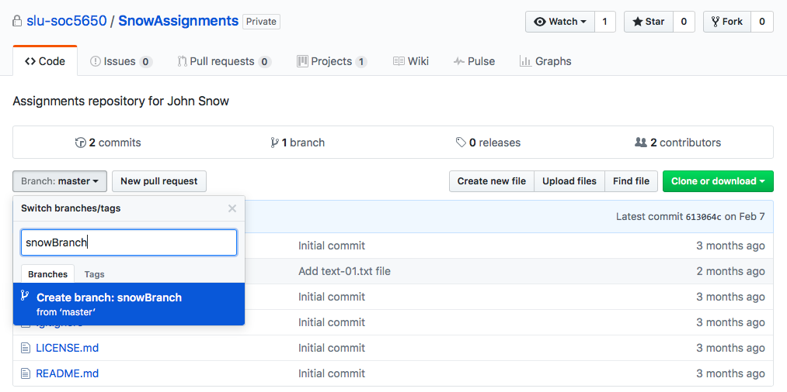
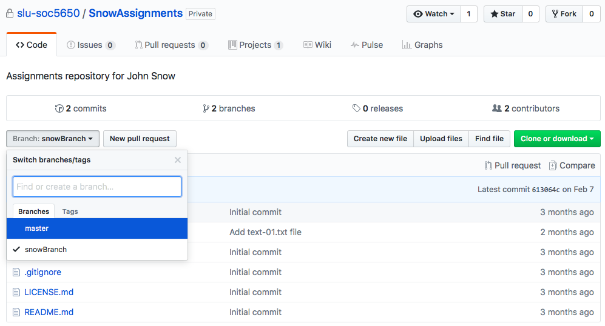
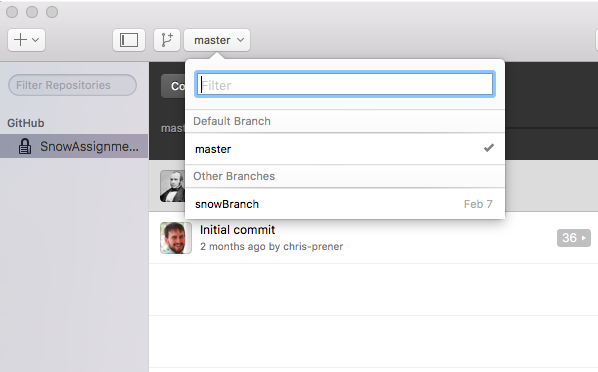
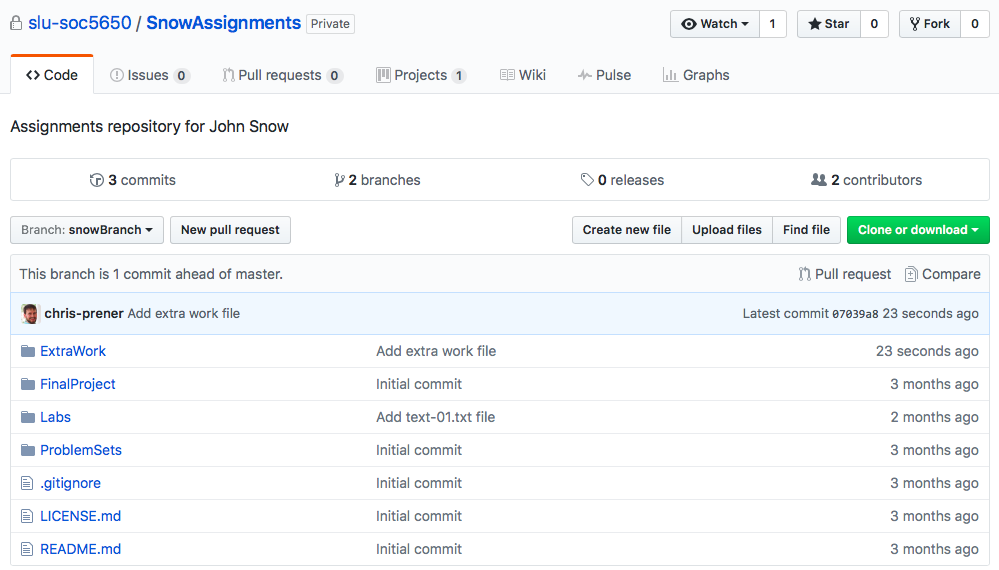
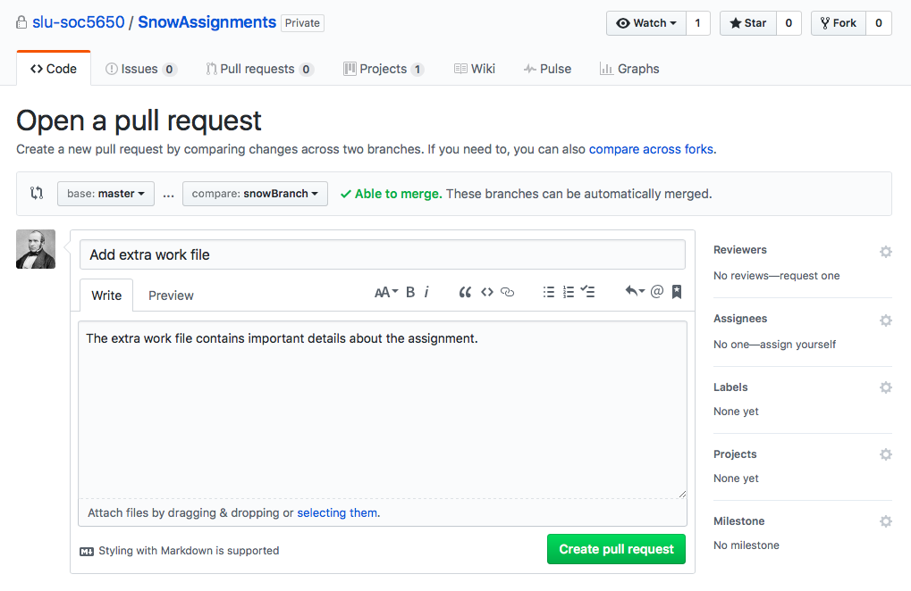
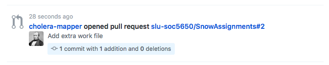
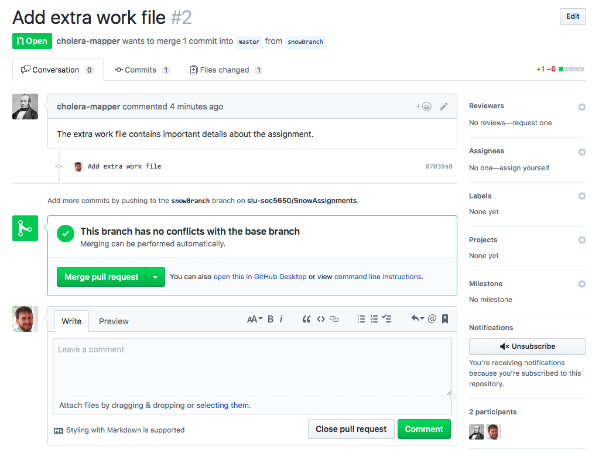
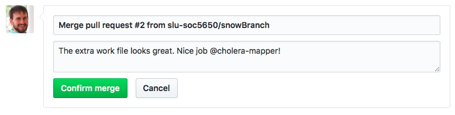

# Advanced GitHub

GitHub has a number of tools available for managing multiple contributors' work simultaneously. These tools will be useful for collaborating with your teammates on the final project. 

## Even More Git-lingo
Beyond the terms introduced in the previous chapter, there are a few additional terms that are specific to collaborating that are helpful to know:

  * **Branch**: An identical copy of the repository that is distinct from the `master` copy. 
  * **Checkout**: The act of switching to a new branch.
  * **Pull Request**: Request that the changes made on a branch be integrated into the `master` copy.
  
## Creating Branches
The logic behind branches is that they allow you to make modifications to the content of the repository without impacting the content that is on the `master` branch. Think of the `master` branch is your production data - this is what you know is good and in working order. If you need to experiment, say by adding new code or data sources, you can do this on a branch without worrying about breaking something in the production part of the repository.

To create a new branch, navigate to the repository in question on GitHub.com. Just above the list of the repository's contents on the lefthand side of the winodw is a button that will read "Branch: master". If you pull the associated menu down, you have the ability to create a new branch (by typing a name into the text field) or switch between branches:

```{r echo=FALSE, out.width = '100%'}

```

The image above shows this menu pulled down with the ficticious user John Snow creating a new branch on his assignments repository named `snowBranch`. Once the branch is created, you will automatically be directed to the new branch's contents. These should look identical to the `master` branch at this point because the branch creation process generates a mirror image of `master`. 

You can use the same pulldown menu to switch back to the `master` branch if needed:

```{r echo=FALSE, out.width = '100%'}

```

### Working with Branches

Once your branch is created, you need to open up GitHub desktop and, if you haven't already, clone the repository you created the branch in. If you have already cloned the repository, you just need to `Sync` it so that the branch information is downloaded to your local copy of the repository. 

Once you have updated or cloned your repository, it is time to **checkout** the branch. This means to switch from the current branch (by default, the `master` branch, to your new branch). In GitHub Desktop, there is a button on the top toolbar that will say the current branch name (by default, `master`). You can click on this button to open a pulldown menu that will list all available branches:

```{r echo=FALSE, out.width = '100%'}

```

Click on a branch to check it out. Once checked out, the files available to your operating system will change to reflect the contents of that branch!

It is important that you ensure that you are always intentionally working on the correct branch. Any time you return to your computer to continue working on a branch, open up GitHub Desktop and ensure that the proper branch remains checked out. 

Branches are used just like regular repos in Git. You can commit changes to them and sync them with GitHub.com. I recommend commiting changes to branches regularly and syncing them with the remote version of the repository to ensure that your work is not lost.

### Opening Pull Requests

When you have made changes to your branch and want to integrate them into the `master`, production part of your repository, it is time to open a **pull request**. Below, you will see that a directory named `ExtraWork` has been added to the `SnowAssignments` repository's `snowBranch`:

```{r echo=FALSE, out.width = '100%'}

```

We have verified that the file is complete and ready for integration into the `master` branch. To do this, we need to click on the `New pull request` button just to the right of the `Branch` button above your repository contents. Make sure that you are opening the pull request on your branch and not on the `master`!

```{r echo=FALSE, out.width = '100%'}

```

The **pull request** page looks very similar to GitHub's **Issue** feature - there is a place for a title (which will be autofilled for you) and for describing the contents and signifiance of your changes. You can optionally assign individual reviewers (such as your final project team members). Once you are done, click the green `Create pull request` button.

### Evaluating Pull Requests
When a team member opens a **pull request**, you should see a notification in your news feed on the main landing page when you log into GitHub.com:

```{r echo=FALSE, out.width = '100%'}

```

Clicking on that message (or, alternatively, selecting the `Pull Requests` tab in any repository) will take you to a page where you can evaluate changes that were made on your colleague's branch:

```{r echo=FALSE, out.width = '100%'}

```

Here you can:
*  view files that have been changed or added,
*  respond to the pull request with a comment if you have follow-up questions,
*  view the results of GitHub's conflict check,
*  and choose an outcome (either merging - i.e. accepting - the pull request or closing - i.e. rejecting - the pull request)

This is an integral step. It is part of the peer review process that drives open-source software and is conducted in the same spirit of peer review that academics use to evaluate publications. The goal here is provide constructive feedback about proposed additions or changes. If you choose to close (i.e. reject) a pull request, give a detailed explanation as to why you are doing so.

If you see that there are conflicts with the base (i.e. `master`) branch, please let Chris know immediately to problem solve before any pull requests are accepted.

If you want to accept the changes, select the green `Merge pull request` button. Chosing this button will open up a space for you to add a commit message that corresponds with accepting the pull request:

```{r echo=FALSE, out.width = '100%'}

```

After filling out your commit message and selecting `Confirm merge`, you have one final opportunity to either roll back the changes (by chosing `Revert`) or make them permanent by chosing `Delete branch`.
