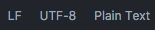
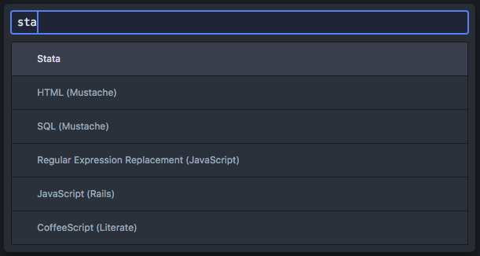
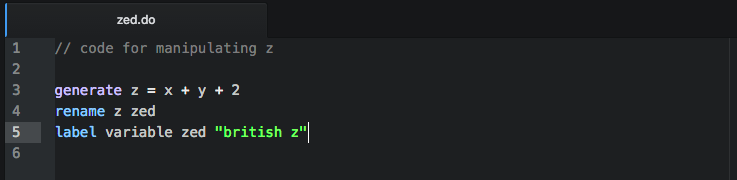
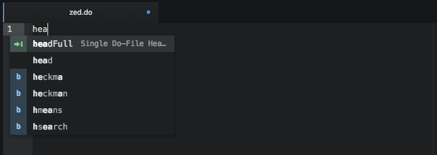
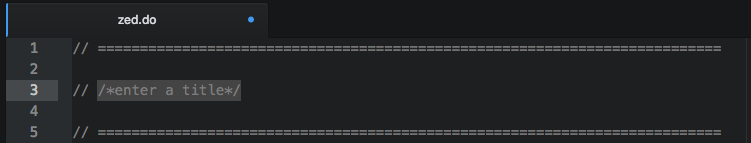
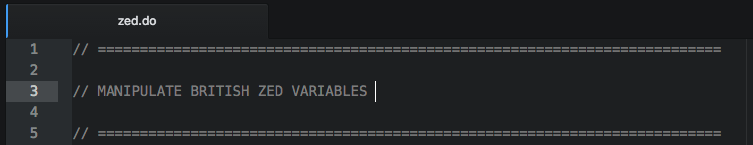
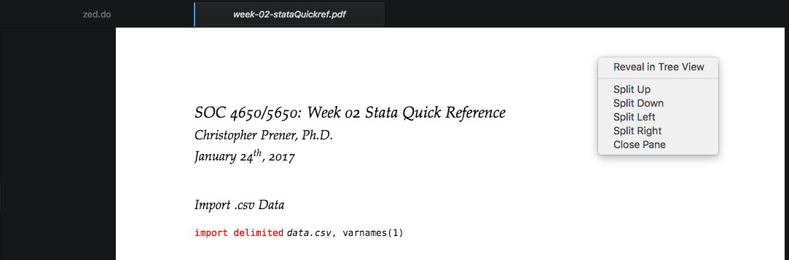
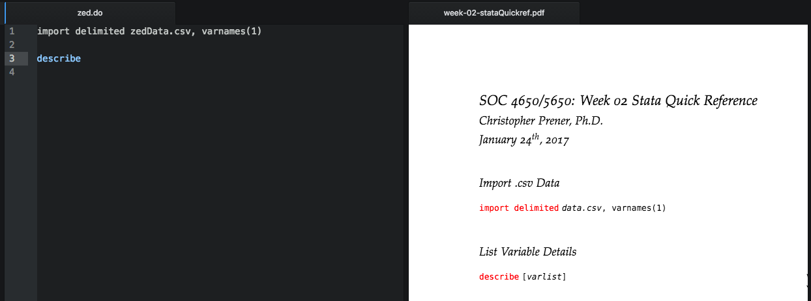
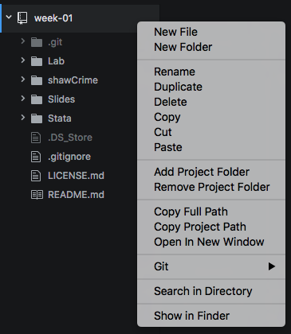

# Introduction to Atom

[Atom](https://atom.io) is a flexible and simultaneously simple and powerful text editor. Text editors, unlike word processors, are not full fleged word processors. They are designed to work with *plain text*, which is ideal for working with computer code. Plain text is also ideal from a reproducibility standpoint, because it does not rely on proprietary file types like Microsoft's Word document.

## Packages
Packages for Atom are user-written programs that extend or expand its functionality. Atom is designed to be modular and thus can be almost endlessly customizable through the addition of various packages. When you open Atom, you can go to the Packages menu and see that some packages are already installed for you. One of these, **Markdown Preview**, is very helpful for getting a sense of what the Markdown syntax you are writing looks like. We'll come back to that package in the "Introducing Markdown" chapter.

New packages can be added through `File > Preferences`^[For users on macOS, you will find the Preferences under the Atom menu.]. The Packages tab will summarize all of the packages you have currently installed. These will be segregated between Core Packages, those that power the base Atom distribution you downloaded, and Community Packages, which are packages that you choose to install to extend Atom. For most packages, you have the ability to access their settings and, when necessary, install updates.

The `Install` tab will allow you to search for and install those Community Packages. The following packages will be *required* for this course:

  - `language-stata`
  - `linter`
  - `linter-markdown`
  - `pdf-view`
  - `tidy-markdown`

## Languages

One of Atom's strengths is its ability to accommodate various programming languages. By default, Atom documents are opened as plain text files. We'll be using two primary file formats this semester: GitHub Markdown and Stata. Support for GitHub Markdown is included in Atom's base distribution. Support for Stata is enabled with the installation of the `language-stata` package.

To switch between languages, you can either click on the language name in the lower righthand corner of the Atom screen. Again, by default, this will say "Plain Text" in a new document:

```{r echo=FALSE, out.width = '35%'}

```

Use the search bar that appears to find the desired language, make sure it is highlighted, and hit Enter to select and switch to that language:

```{r echo=FALSE, out.width = '75%'}

```

Once you select the language, Atom will provide syntax highlight to identify distinguishing features of your code, like commands, comments, and quoted text:

```{r echo=FALSE, out.width = '100%'}

```

The exact appearance of the highlighting will change based on the theme that is enabled. These theme selections can be changed under `File > Preferences > Theme` tab.

When you save files, be sure to include the appropriate `.do` file extension for Stata do-files or `.md` for Markdown files. When you open files with `.do` file extensions, Atom will recognize that they are Stata do-files and automatically change the language setting to Stata. Likewise, it will recognize and adjust for Markdown files.

## Using Snippets

One of the advantages of working with Atom is that it has a powerful set of autocomplete tools. One aspect of these tools are what Atom calls "snippets". These are blocks of text or code that can be expanded with a short trigger phrase called a "prefix". The [`week-02`](https://github.com/slu-soc5650/week-02) repository contains a file with several snippets for both Stata and Markdown files.

### Installing Snippets

To install these snippets, open up the file `atomSnippets.cson` in Atom. Then go to File > Snippets. The `snippets.cson` file will open. Any valid snippets saved here will be accessible to you when their associated programming language is activated in Atom. So, snippets for GitHub Markdown are only available when GitHub Markdown is selected, and snippets for Stata are only available when Stata is selected. Copy and paste the contents of `atomSnippets.cson` into `snippets.cson` beginning on a new line of the file. Save `snippets.cson`, close all open tabs, and restart Atom.

### Expanding Snippets

To use a snippet, you'll want to change the programming language to the appropriate selection. Begin typing the prefix for your snippet, and a dropdown menu will appear. For example, typing `hea` in a Stata file when you are using our class snippets will bring up the following options:

```{r echo=FALSE, out.width = '100%'}

```

The green arrow icon indicates that the option is a snippet. No icon indicates that Atom is offering the full spelling of what it thinks is the appropriate word - "head" in this case. The blue "b" icon indicates a possible Stata command (this functionality is only available when the language is set to Stata).

You can use the up and down arrow keys to select a snippet from this list. Hit the Enter key for the selected snippet, and the snippet will expand into your file.

### Using Tab Stops

Both of the primary snippets for this class include spaces for your to customize their content after you have expanded them. Once a snippet is expanded, the cursor will be automatically directed to the first tab stop. In the Stata snippet, that is a space to give your do-file a title:

```{r echo=FALSE, out.width = '100%'}

```

*Without clicking anywhere* with your mouse, begin typing. Atom will replace the placeholder text with what you type:

```{r echo=FALSE, out.width = '100%'}

```

When you are done typing, hit the `Tab` key to be directed to the next tab stop. Continue typing and using the `Tab` key to move through the template.

If you loose the Tab functionality for whatever reason, make sure you remove the `/*` and `*/` fences that sit on either side of the placeholder text. For Stata in particular, leaving these behind may cause errors or unexpected output.

## Using Panes

Another advantage of Atom is that it allows you to work with multiple files open at once. This is helpful if you want to place our replication code side-by-side with your own code, or you want to keep reference materials close at hand as you write. You can achieve the split screen effect by right clicking on an open document and selecting Split Right:

```{r echo=FALSE, out.width = '100%'}

```

After you choose Split Right, you will have two panes displayed side by side:

```{r echo=FALSE, out.width = '100%'}

```

This can allow you to refer to reference material as you write code, which you may find useful.

## Using Project Folders

Project folders are directories that you make visible in the **Tree View**, the column on the lefthand side of Atom's window. Directories can be added to the Tree View by going to `File > New Project Folder...`. Once a directory has been added, you have full control over its contents. This includes the ability to drag and drop files into subdirectories, copy and paste files from one project folder to another, create new files, and create new subdirectories. Much of this functionality is accessed by right clicking on the project directory itself:

```{r echo=FALSE, out.width = '75%'}

```

To modify specific files, you can right click on the file itself.

Project folders make it possible to keep a weekly repository, the assignment directories for that week, and your assignment repository all close at hand. This will allow you to easily access example and reference materials, edit assignment files, and copy assignment files directly into your assignment repository for submission.
